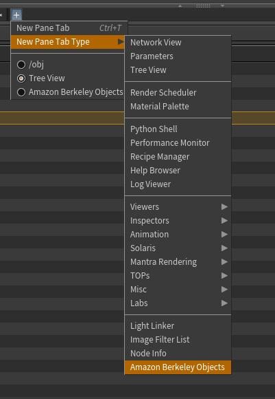

# ABO 3d objects file browser for Houdini

[Amazon Berkeley Objects dataset](https://amazon-berkeley-objects.s3.amazonaws.com/index.html) model file browser for Houdini.

## Plugin Installation

1. Download the "Plugin" folder.
2. Download the [ABO 3d model archive](https://amazon-berkeley-objects.s3.amazonaws.com/archives/abo-3dmodels.tar) (150 GB! you don't need to extract contents!)
3. Configure ABO.json inside the plugin folder:
	1. Point "ABO" var to the plugin root folder
	2. Point "ABO_MODEL_ARCHIVE" var to the .tar file downloaded
	3. Copy ABO.json to your Houdini user folder -> packages
	
Once installed restart Houdini and ppen the ABO Python panel to start searching objects:

## Credits & License

data, including all images and 3D models: [Amazon](http://www.amazon.com)

dataset, archives and benchmark:
- Matthieu Guillaumin
- Thomas Dideriksen
- Kenan Deng
- Himanshu Arora
- Arnab Dhua
- Xi (Brian) Zhang
- Tomas Yago-Vicente
- Jasmine Collins
- Shubham Goel
- Jitendra Malik

** Please refer to the Amazon terms for 3d model [usage and licensing](https://amazon-berkeley-objects.s3.amazonaws.com/LICENSE-CC-BY-4.0.txt)
